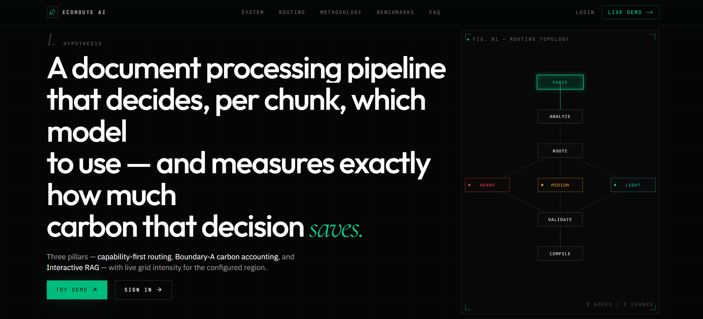
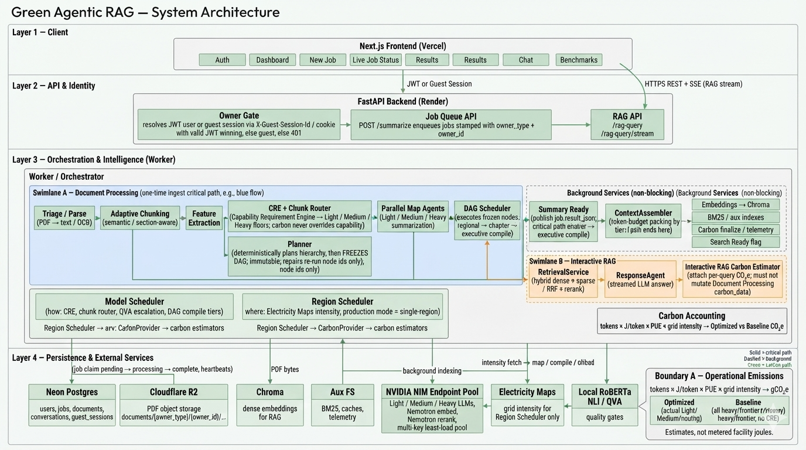
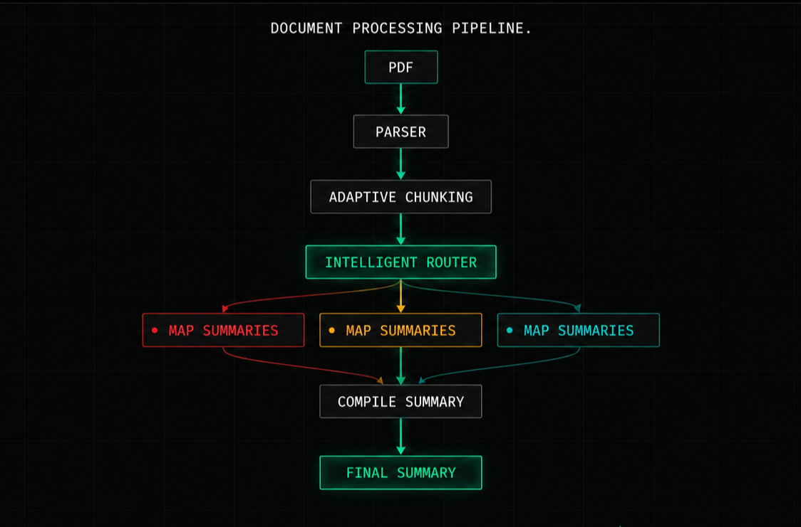
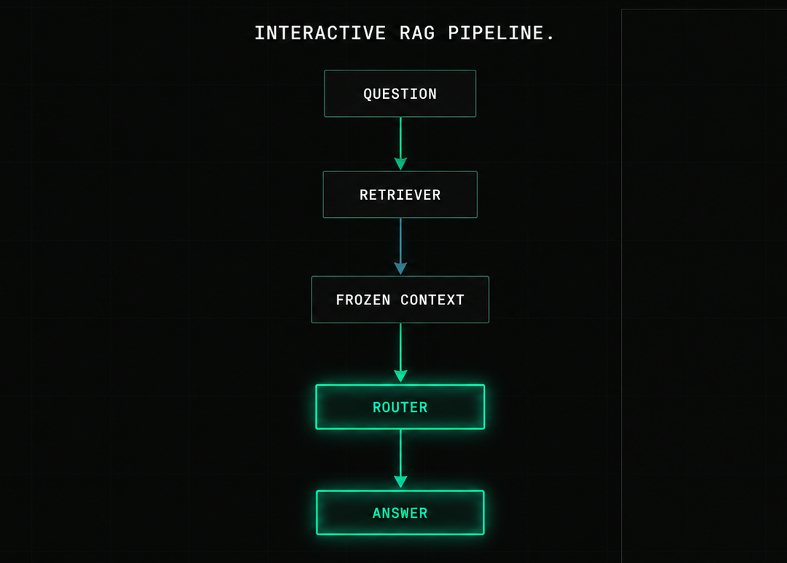
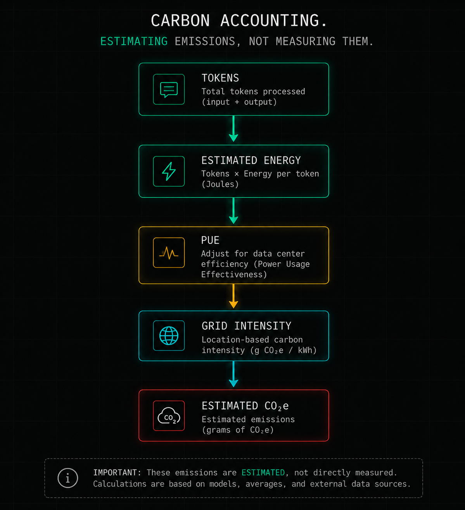
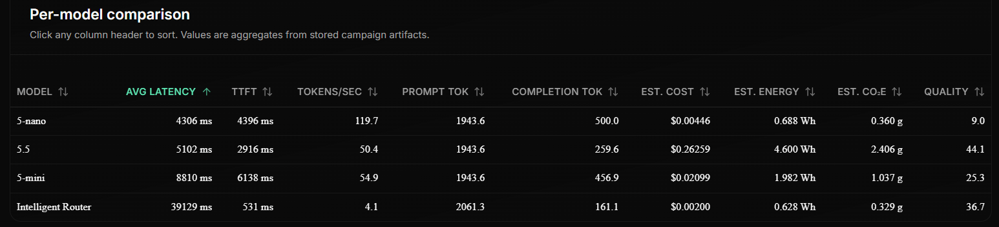
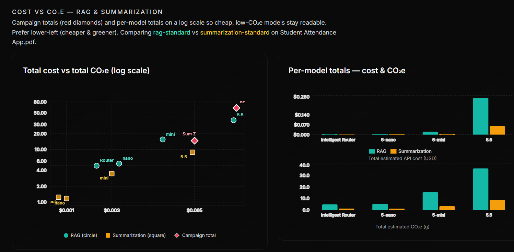

# EcoRoute AI

<p align="center">
  
</p>

**Carbon-aware AI document processing** with adaptive model routing, end-to-end summarization, interactive RAG, and a reproducible evaluation framework.

Most AI document tools maximize quality with the largest model they can afford. This project treats **model choice as an optimization problem** — under quality, latency, cost, and carbon constraints — and makes that choice measurable.

---

## Why I Built This

Current AI systems often use one model for an entire workflow. That is simple to ship, but expensive: every easy chunk, every retrieval step, and every compile stage pays the same capability tax as the hardest passage in the document.

In practice, different parts of a pipeline do not need the same model. A short definitional paragraph rarely needs a frontier model. A dense table, legal clause, or medical section might. Blind demotion destroys trust; blind promotion wastes compute and emissions.

This project explores **routing work to Light / Medium / Heavy models** based on capability requirements, validating quality before accepting cheaper tiers, and reporting **estimated cost and operational CO₂e** alongside latency and answer quality. Document ingestion and interactive Q&A are accounted for separately, so one-time processing is never confused with per-query chat cost.

---

## Features

- ✓ Adaptive document processing  
- ✓ Intelligent model routing (CRE + per-chunk tiers)  
- ✓ End-to-end hierarchical summarization  
- ✓ Interactive RAG with streaming answers  
- ✓ Operational carbon accounting (Document Processing vs Interactive RAG)  
- ✓ Benchmark campaigns  
- ✓ Campaign comparison  
- ✓ Quality evaluation  
- ✓ Benchmark analytics dashboard  

---

## System Architecture

<p align="center">
  
</p>

Next.js frontend → FastAPI API / worker → Postgres, object storage, Chroma → NVIDIA NIM (and quality gates), with independent **model scheduling** (which tier) and **region scheduling** (grid intensity for accounting).

Deep dive: [`docs/architecture.md`](docs/architecture.md)

---

## Document Processing Pipeline

<p align="center">
  
</p>

Upload → triage / chunk → feature extraction → CRE + adaptive routing → parallel map (Light / Medium / Heavy) → QVA escalation → frozen compile DAG → Summary Ready → background indexing & carbon finalize.

Capability floors are never overridden by “eco” preferences. Carbon is an optimization weight, not a quality bypass.

---

## Interactive RAG Pipeline

<p align="center">
  
</p>

After Search Ready, questions hit a **separate path**: hybrid retrieval → context packing → response generation (streamed) → per-query carbon estimate. Interactive RAG never rewrites Document Processing `carbon_data`.

---

## Carbon Accounting

<p align="center">
  
</p>

**Boundary A — operational emissions** (inference and related facility electricity via PUE). Shared model:

```text
tokens × J/token × PUE × grid intensity → gCO₂e
```

| Account | What it measures |
|--------|-------------------|
| **Document Processing** | One-time ingest (map + compile + shared stages) |
| **Interactive RAG** | Per chat turn (embed / retrieve / generate) |
| **Lifetime (derived)** | Doc + session RAG — never the primary metric |

Optimized vs Baseline compares actual routing against a naive all-heavy path. Values are **estimates**, not metered facility joules.

Methodology: [`docs/carbon-accounting.md`](docs/carbon-accounting.md)

---

## Benchmark Results

<p align="center">
  
</p>

<p align="center">
  
</p>

Frozen-input campaigns compare the intelligent router against frontier baselines on quality, latency, estimated cost, and estimated CO₂e — with campaign sync into the analytics UI.

How campaigns are run and interpreted: [`docs/benchmark-methodology.md`](docs/benchmark-methodology.md) · [`docs/evaluation.md`](docs/evaluation.md)

---

## Repository Structure

```text
.
├── assets/                 # README / portfolio diagrams and screenshots
├── backend/                # FastAPI API, worker, agents, carbon, RAG, tests
│   ├── src/                # Application code (api, core, agents, carbon, …)
│   ├── tests/              # Backend test suite
│   ├── docs/               # Engineer deep-dives (orchestration, guest mode, …)
│   └── scripts/            # Ops and evaluation helpers
├── frontend/               # Next.js App Router UI (jobs, results, chat, benchmarks)
├── docs/                   # User-facing architecture, carbon, benchmarks, deployment
├── benchmark_results/      # Campaign outputs and study write-ups
├── mcp_server/             # Architecture intelligence MCP over the code graph
├── scripts/                # Repo-level utilities
├── archive/                # Historical migration / audit notes
└── SYSTEM_ARCHITECTURE.md  # Canonical architecture summary
```

| Path | Role |
|------|------|
| `backend/` | Document jobs, routing, DAG compile, RAG, carbon estimators, auth / guest Owner model |
| `frontend/` | Product UI: upload, live status, results, chat, dashboard, benchmarks |
| `docs/` | Readable guides for architecture, methodology, and deployment |
| `benchmark_results/` | Saved campaign JSON / markdown studies |
| `mcp_server/` | Optional graph tools for exploring this codebase |
| `assets/` | Images referenced by this README |

---

## Getting Started

### Prerequisites

- Python **3.10+**
- Node.js **18+**
- NVIDIA API key from [build.nvidia.com](https://build.nvidia.com/settings/api-keys)
- Optional: Electricity Maps API key for live grid intensity

### Installation

```bash
git clone <repository-url>
cd green-agentic-rag-main
```

### Backend

```bash
cd backend
python -m venv .venv

# Windows
.venv\Scripts\activate
# macOS / Linux
# source .venv/bin/activate

pip install -r requirements.txt
cp .env.example .env   # set NVIDIA_API_KEY (and JWT_SECRET_KEY)
```

Minimum `.env` for local use:

```bash
NVIDIA_API_KEY=your_nvidia_api_key
APP_ENV=development
OBJECT_STORAGE_BACKEND=local
CORS_ALLOW_ALL=true
```

### Frontend

```bash
cd frontend
npm install
```

Create `frontend/.env.local`:

```bash
NEXT_PUBLIC_API_URL=http://localhost:8000
```

### Running

**Terminal 1 — API**

```bash
cd backend
.venv\Scripts\activate   # or: source .venv/bin/activate
uvicorn src.api.main:app --reload --host 127.0.0.1 --port 8000
```

**Terminal 2 — Worker** (required for document jobs unless you run with an embedded worker)

```bash
cd backend
.venv\Scripts\activate
python -m src.worker
```

**Terminal 3 — Frontend**

```bash
cd frontend
npm run dev
```

| Service | URL |
|---------|-----|
| App | http://localhost:3000 |
| API docs | http://localhost:8000/docs |
| Health | http://localhost:8000/api/health |

Upload a PDF via **New Job**, wait for Summary Ready, then ask questions in chat.

More detail (including production Vercel + Render): [`docs/deployment.md`](docs/deployment.md) · [`QUICKSTART.md`](QUICKSTART.md)

---

## Documentation

| Guide | Topic |
|-------|--------|
| [Architecture](docs/architecture.md) | System design, pipelines, modules |
| [Carbon methodology](docs/carbon-accounting.md) | CO₂e estimation, boundaries, assumptions |
| [Benchmark methodology](docs/benchmark-methodology.md) | Frozen inputs, campaigns, UI sync |
| [Evaluation](docs/evaluation.md) | Quality metrics and how to read studies |
| [Deployment](docs/deployment.md) | Local setup and production stack |

Engineer notes that track the code closely: [`backend/docs/`](backend/docs/)  
Product thesis: [`PROJECT_OVERVIEW.md`](PROJECT_OVERVIEW.md)

---

## License

See the repository license file (if present) or contact the author for usage terms.
