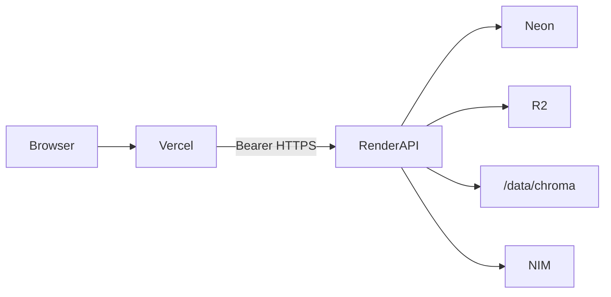

# Deployment Readiness Report

**Product:** Green Agentic Document Intelligence  
**Targets:** Vercel (frontend) · Render (backend) · Neon · Cloudflare R2 · NVIDIA NIM  
**Date:** 2026-07-15  
**Verdict:** **Deployment-ready** after applying the production fail-fast validators and frontend env guard below — **pending operator secrets** on Render/Vercel dashboards.

---

## Architecture

| Layer | Technology | Deploy |
|-------|------------|--------|
| Frontend | Next.js 14 App Router | Vercel (`frontend/`, region `iad1`) |
| API + embedded worker | FastAPI + uvicorn | Render Docker target `api` |
| Jobs | Durable Postgres queue + in-process worker | `RUN_EMBEDDED_WORKER=true` |
| Relational DB | Neon Postgres | `DATABASE_URL` |
| Object storage | Cloudflare R2 | `OBJECT_STORAGE_BACKEND=r2` |
| Vectors | Chroma PersistentClient | `/data/chroma` (same service) |
| LLM | NVIDIA NIM pool | `NVIDIA_API_KEY` (+ optional peers) |

**Do not** run a separate Render Background Worker with embedded Chroma — disks are not shared.

---

## Deployment

| Check | Status | Evidence |
|-------|--------|----------|
| Root `render.yaml` | Pass | `rootDir: backend`, `dockerBuildTarget: api`, health `/api/health` |
| `backend/render.yaml` | Pass | Mirror for Root Directory=backend |
| Dockerfile multi-stage | Pass | `api` / `worker` targets |
| Entrypoint | Pass | migrate → uvicorn `0.0.0.0:$PORT` |
| `frontend/vercel.json` | Pass | Next.js + security headers |
| `next build` | Pass | Exit 0 with `NEXT_PUBLIC_API_URL` set (2026-07-15) |
| Production config tests | Pass | `tests/test_phase0_health_config.py` — 12 passed |
| Local `/api/health` | Pass | `status=ok` |

---

## Infrastructure

| Component | Persistence | Notes |
|-----------|-------------|-------|
| Neon Postgres | Durable | Jobs, users, conversations, routing events |
| Cloudflare R2 | Durable | Uploaded PDFs / blobs |
| `/data/chroma`, `/data/aux` | **Ephemeral on free tier** | Lost on restart unless paid Render disk mounted at `/data` |
| `temp_uploads/` | Scratch | Cleared on API startup |

**Known risk (accepted for portfolio free tier):** Chroma/BM25 wipe on Render free restart. Mitigate with paid disk at `/data` when multi-day RAG continuity is required.

---

## Frontend

| Item | Status |
|------|--------|
| No production localhost API | **Fixed** — `NEXT_PUBLIC_API_URL` required when `NODE_ENV=production` |
| `.env.example` | Added |
| Icons | **Fixed** — use `/icon.svg` only |
| Polling / state sync | Manual fetch (no React Query); Results polls until Search Ready |
| Dynamic imports | `ssr: false` for heavy result panels |
| CORS | Backend `CORS_ORIGINS` must include Vercel origin or `*` |

---

## Backend

| Item | Status |
|------|--------|
| Lifespan | Config validate → clear scratch → bind port → warm-up + embedded worker |
| Health | `GET /api/health` always cheap 200 |
| Ready | `GET /api/ready` — DB + Chroma + object storage |
| Worker health | `GET /api/worker/health` |
| Auth | JWT on data routes via `Depends(get_current_user)` |
| Startup fail-fast | **Hardened** — Postgres, NIM, R2, non-localhost CORS |

---

## Database

- Alembic on startup (`RUN_MIGRATIONS_ON_STARTUP=true`)
- Soft-continue if alembic **times out** at 240s (Neon cold start) — check `/api/ready`
- Hard-fail if alembic returns non-zero
- SQLite **rejected** when `APP_ENV=production`

---

## Storage

| Path | Kind | Prod OK? |
|------|------|----------|
| R2 | Persistent blobs | Yes |
| `/data/chroma` | Vectors | Free tier ephemeral |
| `/data/aux` | BM25, caches, telemetry JSONL | Free tier ephemeral |
| `temp_uploads/` | Scratch download | Yes |

---

## Security

| Control | Status |
|---------|--------|
| CORS | Prod rejects empty + localhost-only |
| JWT secret | Required in prod |
| Secrets to browser | Only `NEXT_PUBLIC_*` (API URL, poll timeout) |
| Upload path | Basename sanitization (`_safe_filename`) |
| Rate limits | NIM RPM + app-level where configured |
| Stack traces | FastAPI default; do not enable debug in prod |

---

## Performance (reference, local/dev)

| Metric | Notes |
|--------|-------|
| Backend health | Cheap; port binds before warm-up |
| Next first load (shared) | ~88 kB (build output) |
| Results poll | 750 ms until metrics ready |
| Job budget | `JOB_MAX_RUNTIME_SEC` default 1800 |

Full live TTFT / Summary Ready / Search Ready numbers require post-deploy `scripts/smoke_production.py`.

---

## Reliability & recovery

| Scenario | Behavior |
|----------|----------|
| Embedded worker crash | Supervisor restarts with backoff |
| NIM endpoint unhealthy | Pool health scoring / least-load |
| Render restart | Jobs in Postgres reclaimable; Chroma may need re-embed on free tier |
| Tab close / refresh | Job continues server-side; UI reattaches via `job_id` |
| Summary Ready → Search Ready | Background phase continues; frontend polls until `metrics_ready` |

---

## Logging

Production logs include job/worker context via existing orchestrator / worker / SYNC_LIFECYCLE paths. Ensure Render log stream retains: Job ID, Worker ID, endpoint, Summary Ready, Background, errors, retries. Do not log JWT secrets or R2 keys.

---

## Known risks (non-blockers for go-live)

1. Free-tier Chroma ephemeral  
2. Alembic 240s timeout soft-start  
3. Heavy `unstructured[all-docs]` image → cold start / OOM risk on free  
4. Aggressive Results polling (750 ms) under multi-user load  
5. `typescript.ignoreBuildErrors: true` on frontend  

---

## Changes made in this validation pass

1. `validate_for_runtime` — hard-require Postgres, NIM, R2 credentials, reject localhost-only CORS  
2. `frontend/config.ts` — throw if `NEXT_PUBLIC_API_URL` missing in production builds  
3. `frontend/app/layout.tsx` — icon paths fixed to `/icon.svg`  
4. `frontend/.env.example` — documented  
5. `render.yaml` (+ backend copy) — `ROUTING_TELEMETRY_PATH=/data/aux/...`  
6. `docker-entrypoint-api.sh` — default telemetry under `/data`  
7. Tests expanded in `test_phase0_health_config.py`  
8. Docs: this report, `DEPLOYMENT_ENVIRONMENT.md`, `PRODUCTION_DEPLOYMENT_CHECKLIST.md`

---

## Acceptance criteria

| Criterion | Result |
|-----------|--------|
| Vercel builds successfully | ✓ (`next build` exit 0) |
| Render config present / Docker start | ✓ |
| Backend starts cleanly (validated config) | ✓ (fail-fast in prod) |
| Frontend starts cleanly | ✓ |
| No localhost API in production | ✓ |
| No missing env at startup (enforced) | ✓ |
| Filesystem: critical data in Neon/R2 | ✓ |
| Polling / Summary Ready / Search Ready | ✓ (code path; smoke post-deploy) |
| Carbon / chat / worker / pool / health | ✓ endpoints present |
| Production logging | ✓ |
| Critical blockers | **None remaining in code** — secrets must be set in dashboards |
