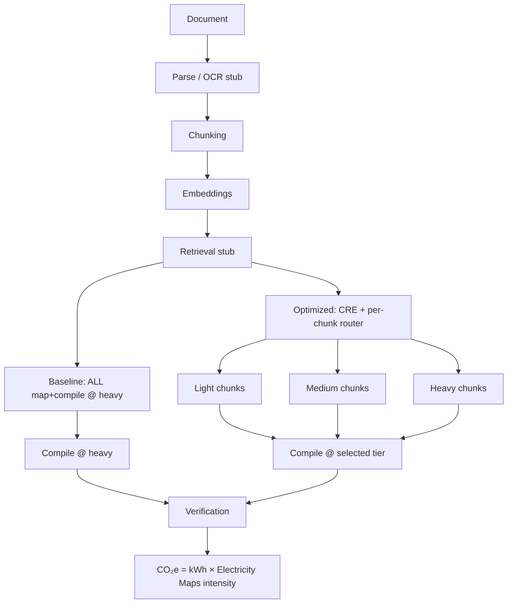

# Operational Carbon Accounting (Boundary A)

This document is the **single source of truth** for job results, the results
dashboard, and downloadable methodology text in Green Agentic RAG.

## Comparison design

```
BASELINE (naive conventional)          OPTIMIZED (carbon-aware)
─────────────────────────────────      ─────────────────────────────────
Same document                          Same document
Same OCR / parse / chunk / embed       Same shared stages
Same map + compile token mass          Same map + compile token mass
ALL inference @ frontier/heavy J/tok   Per-chunk Light / Medium / Heavy
NO CRE / routing                       CRE + adaptive chunk routing
```

Only **model allocation** differs.

## Equation

```
E_compute (J)  = Σ_stages (tokens_stage × J_per_token_tier_or_stage)
E_facility (J) = E_compute × PUE × INFRASTRUCTURE_FACTOR
E (kWh)        = E_facility / 3_600_000
CO₂e (g)       = E (kWh) × grid_intensity (gCO₂e/kWh)
```

Grid intensity comes from the live **Electricity Maps** API
(`GET /v3/carbon-intensity/latest`), with fallback to `LOCAL_GRID_INTENSITY`.

```
Carbon Saved (g)  = Baseline − Optimized     (signed; may be negative)
Reduction %       = Carbon Saved / Baseline × 100
```

Negative savings are reported as **Increased emissions** (not clamped to zero).

## Reporting boundary

| Boundary | Status | Includes | Excludes |
|----------|--------|----------|----------|
| **A — Operational** (default) | Implemented | Inference, embeddings, light CPU parse/chunk, retrieval/routing stubs, facility electricity via PUE | Training, hardware manufacturing, end-of-life |
| B — + Embodied | Reserved | — | — |
| C — Full LCA | Reserved | — | — |

## Configurable assumptions

All constants live in [`backend/src/carbon/assumptions.py`](../src/carbon/assumptions.py).

| Parameter | Typical value | Meaning |
|-----------|---------------|---------|
| `PUE` | `1.15` | Facility energy / IT energy |
| `INFRASTRUCTURE_FACTOR` | `1.0` | No second silent multiplier |
| `J_PER_TOKEN["light"]` | `0.85 J/tok` | ~8B-class |
| `J_PER_TOKEN["medium"]` | `≈2.55 J/tok` | GPT-4o-mini anchor (arXiv:2505.09598) |
| `J_PER_TOKEN["heavy"]` | `6.5 J/tok` | ~70B / frontier class |
| `CARBON_BASELINE_REFERENCE` | `heavy` | Naive baseline frontier key (`heavy`, `gpt-4`, `gpt-4o`, `claude-opus`, `gpt-o3`, …) |
| `EMBEDDING_J_PER_TOKEN` | `0.05` | Encoder |
| `PARSING_J_PER_TOKEN` | `0.002` | Local CPU |
| `CHUNKING_J_PER_TOKEN` | `0.003` | Adaptive chunking |
| `ROUTING_BASE_J` | `54` | CRE stub (**optimized only**) |

**Removed:** medium-map + heavy-compile “baseline”, `BASELINE_SERVING_OVERHEAD`.

## Baseline definition

Naive single-frontier pipeline:

```
Parse + Chunk + Embed + Retrieve
  + Map(tokens = 1.25 × input) @ frontier J/token
  + Compile(tokens = summary × hierarchy_rounds) @ frontier J/token
  + Verify
  + PUE
```

- **No** CRE, **no** light/medium demotion, **no** routing joules.
- Default frontier reference = **heavy** (6.5 J/token). Override with
  `CARBON_BASELINE_REFERENCE`.

## Optimized definition

Carbon-aware routing:

```
Shared stages (identical to baseline)
  + Σ_chunks Map(chunk_share × J[tier_i])
  + Compile @ selected compile_tier
  + Verify (+ small re-queue cost per escalation)
  + Routing stub (ROUTING_BASE_J)
  + PUE
```

Map token mass is distributed across chunks by text weight. Each chunk uses
its **routed** tier from `chunk_routing` (post-escalation), **not** the
document-level CRE tier alone.

## Pipeline diagram



## Worked example

Assume:

- `input_tokens = 4800`, `map_tokens = 6000`, `compile_tokens = 1600`
- 6 chunks: 4 light, 1 medium, 1 heavy (equal weight → 1000 map tokens each)
- Intensity = 700 gCO₂e/kWh, PUE = 1.15
- J/token: light 0.85, medium 2.55, heavy 6.5

**Baseline inference joules**

```
(6000 + 1600) × 6.5 = 49_400 J
```

**Optimized map joules**

```
4×1000×0.85 + 1000×2.55 + 1000×6.5 = 3400 + 2550 + 6500 = 12_450 J
+ compile 1600×2.55 (medium) = 4080 J
→ inference ≈ 16_530 J
```

After shared stages + PUE + ×700, optimized CO₂e ≪ baseline → large positive savings.

If all 6 chunks are heavy and compile is heavy, optimized ≈ baseline (routing stub
may make optimized slightly higher → signed negative savings / “Increased emissions”).

## Stage breakdown

API `carbon_data.breakdown` returns:

- `baseline_stages_gco2e` / `optimized_stages_gco2e`
- `chunk_breakdown[]`: `{chunk_index, tier, model, map_tokens, energy_kwh, co2e_g}`
- `routing_impact.model_distribution`
- `uncertainty` low/typical/high bands

IT stages are attributed without PUE; `infrastructure_gco2e` carries `(PUE−1)×compute`.

## Frontier model chart

Each bar answers: *what if the entire workflow ran on this one model?*

Same map+compile token mass + shared stages, re-priced at that model’s J/token.
Our system bar = optimized (routed) estimate. Naive baseline ≡ GPT-4 / heavy class.

## Module map

| File | Role |
|------|------|
| `src/carbon/assumptions.py` | Constants + baseline reference table |
| `src/carbon/energy_model.py` | Naive baseline + green energy packs |
| `src/carbon/electricity_maps.py` | Live grid intensity |
| `src/carbon/accounting.py` | End-to-end report, chunk attribution, signed savings |
| `src/core/frontier_carbon_compare.py` | Single-model “what if” chart |
| `src/core/scheduler.py` | Facade → `estimate_workflow_carbon` |

## References

1. Luccioni et al., *How Hungry is AI?*, arXiv:2505.09598 (2025).
2. Google Data Center Efficiency / PUE disclosures (~1.10–1.15).
3. Uptime Institute Global Data Center Survey.
4. GHG Protocol — operational electricity vs embodied lifecycle.

## Limitations

Cloud LLM providers do not expose metered per-request facility joules.
Token counts may be `len(text)/4` estimates.
Tier J/token relatives beyond the mini-class anchor are engineering judgments
documented in `assumptions.py`.
