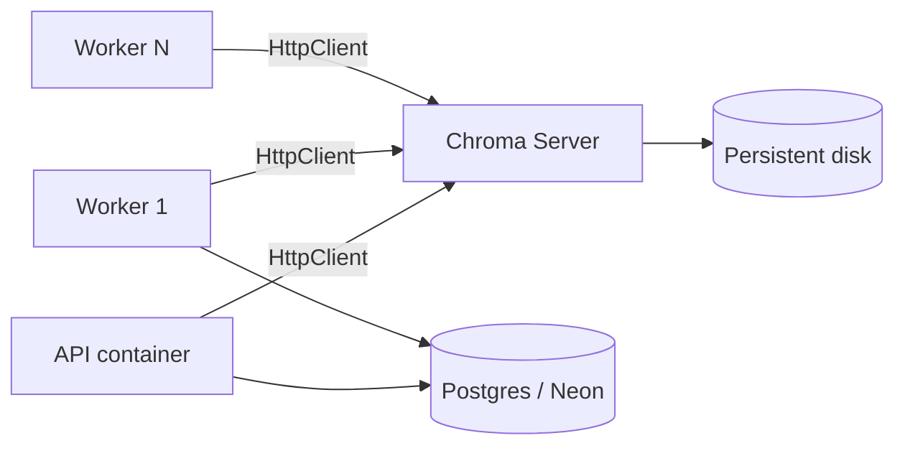

# ChromaDB Production Architecture (Render)

**Scope:** Vector store only. No AI / retrieval / routing logic changes. No pgvector.

---

## 1. Audit — current state (before this change)

| Question | Finding |
|----------|---------|
| How is Chroma initialized? | Was `chromadb.Client(Settings(persist_directory=VECTOR_DB_PATH))` at import in `storage.py` |
| Where are embeddings stored? | Chroma collection `CHROMA_COLLECTION_NAME` / `CHUNK_COLLECTION_NAME`; IDs = chunk ids, metadata includes `document_id` |
| Persistent mode? | Yes — local filesystem under `VECTOR_DB_PATH` (default `./local_db/chroma`) |
| Local filesystem assumptions? | Yes — API and Worker each needed the **same** disk mount; Render disks are **per-service** and cannot be shared |
| Cloud-suitable? | **No** for multi-service (API + Worker + N workers) on Render |

Auxiliary files under `VECTOR_DB_PATH` (BM25, embed cache, file conversations) are **not** Chroma embeddings; they remain path-based.

---

## 2. Recommendation (ONE approach)

### **Dedicated Chroma Server (separate Docker / Render private service)**



**Why this is best for Render**

| Option | Verdict |
|--------|---------|
| Embedded persistent on API or Worker | Reject — other services cannot see the same vectors; multi-worker unsafe |
| Shared volume between API+Worker | Reject on Render — disks are not multi-attach |
| **Chroma Server + disk** | **Choose** — one writer/reader endpoint, durable disk, N workers, independent of Postgres |
| pgvector | Out of scope / forbidden |

Same architecture is used in local `docker compose` for parity.

---

## 3. Deployment architecture

### Local (Compose)
- Service `chroma` (`chromadb/chroma:0.5.23`) + volume `chroma_server_data`
- API + Worker: `CHROMA_MODE=http`, `CHROMA_SERVER_HOST=chroma`

### Render
- Private service `green-agentic-chroma` with persistent disk at `/chroma/chroma`
- API + Worker: `CHROMA_MODE=http`, `CHROMA_SERVER_HOST=<chroma private host>`
- See `backend/render.yaml` and `docs/RENDER_DEPLOYMENT.md`

### Env vars

| Variable | Prod value | Notes |
|----------|------------|-------|
| `CHROMA_MODE` | `http` | or `auto` with host set |
| `CHROMA_SERVER_HOST` | chroma hostname | required for http |
| `CHROMA_SERVER_PORT` | `8000` | |
| `CHROMA_SERVER_SSL` | `false` | internal network |
| `CHROMA_AUTH_TOKEN` | optional | Bearer if server auth enabled |
| `CHROMA_COLLECTION_NAME` | `documents_nemotron_v2` | shared name |
| `VECTOR_DB_PATH` | `/data/aux` | BM25/cache only — **not** embeddings |

---

## 4. Modified files

| File | Change |
|------|--------|
| `backend/src/memory/chroma.py` | **New** — client factory, health check, mode resolution |
| `backend/src/memory/storage.py` | Uses `get_chroma_client()`; no embedded-at-import assumption |
| `backend/src/core/config.py` | `CHROMA_MODE`, SSL, auth, tenant; prod warning if not http |
| `backend/src/api/health.py` | Ready check via `chroma_health_check()` |
| `backend/docker-compose.yml` | Chroma service first-class; API/Worker on HTTP |
| `backend/render.yaml` | Chroma private service + API/Worker wiring |
| `backend/.env.example` / `.env.production.example` | New vars |
| `backend/docs/CHROMA_PRODUCTION.md` | This doc |
| `backend/tests/test_chroma_production.py` | Mode + persistent client tests |

**Not modified:** CRE, router, agents, retrieval logic, chunking, validation.

---

## 5. Migration plan

Embeddings previously on a local/embedded disk are **not** automatically visible to the new server.

### Option A — Re-index (recommended)
1. Deploy Chroma server (empty disk) + API/Worker with `CHROMA_MODE=http`.
2. Re-process documents (or re-run summarize jobs) so the worker writes embeddings to the server.
3. Verify RAG on a known `document_id`.

### Option B — Copy data directory (same Chroma major version)
1. Stop writers.
2. Copy old `VECTOR_DB_PATH` Chroma files into the server volume mount (`/chroma/chroma`).
3. Start Chroma server; point clients at it.
4. Smoke-test collection `documents_nemotron_v2`.

### Option C — Fresh start
Accept empty vectors; new uploads populate Chroma going forward. Postgres chunk text remains for re-embed later.

No Alembic / Postgres schema migration is required (vectors stay out of Postgres).

---

## 6. Testing instructions

### Unit
```bash
cd backend
python -m pytest tests/test_chroma_production.py tests/test_phase0_health_config.py -q
```

### Startup wait
API (`storage.init_database` via lifespan) and Worker both call `wait_for_chroma()` with exponential backoff before vector use:

| Env | Default |
|-----|---------|
| `CHROMA_STARTUP_MAX_WAIT_SEC` | `120` |
| `CHROMA_STARTUP_INITIAL_DELAY_SEC` | `0.5` |
| `CHROMA_STARTUP_MAX_DELAY_SEC` | `10` |
| `CHROMA_STARTUP_REQUIRED` | `true` (fail startup if never healthy) |

### Compose (shared Chroma)
```bash
cd backend
docker compose up --build
curl -fsS http://localhost:8000/api/ready   # checks.chroma.mode == http
# Upload a doc → worker indexes → POST /rag-query
```

### Render
1. Apply `render.yaml` (or create Chroma private service manually).
2. Set `CHROMA_MODE=http` + host on API and Worker.
3. `GET /api/ready` → `checks.chroma.ok == true`, `mode == http`.
4. Run smoke: `API_URL=... python scripts/smoke_production.py`.

---

## 7. Multi-worker notes

- All workers use the same `CHROMA_SERVER_HOST` and collection name.
- Chroma server serializes writes; scale workers for CPU/LLM, not for separate vector DBs.
- Do **not** run embedded persistent mode on more than one process against the same path.
