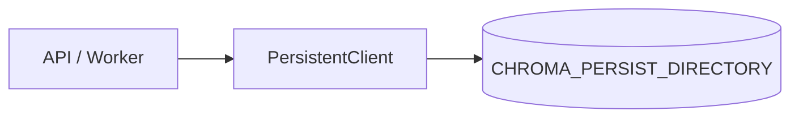

# Chroma — embedded PersistentClient (portfolio deploy)

The application currently uses an embedded Chroma instance for cost-efficient
portfolio deployment. The production deployment architecture supports migrating
to a standalone Chroma server (`HttpClient`) with no application-level changes
beyond restoring an `HttpClient` branch in `src/memory/chroma.py` and pointing
env at that host — collection names and retrieval APIs stay the same.

## Current design

| Question | Answer |
|----------|--------|
| Client | `chromadb.PersistentClient` |
| Path | `CHROMA_PERSIST_DIRECTORY` (default `./local_db/chroma`) |
| Collection | `CHROMA_COLLECTION_NAME` / `CHUNK_COLLECTION_NAME` |
| Startup | `init_chroma()` — local disk only, no network wait |
| Aux files | `VECTOR_DB_PATH` (BM25, embed cache, file conversations) |

## Environment

| Variable | Example | Notes |
|----------|---------|-------|
| `CHROMA_PERSIST_DIRECTORY` | `/data/chroma` | Embeddings |
| `CHROMA_COLLECTION_NAME` | `documents_nemotron_v2` | Unchanged |
| `VECTOR_DB_PATH` | `/data/aux` | Not embeddings |

**Removed (remote server):** `CHROMA_MODE`, `CHROMA_SERVER_HOST`, `CHROMA_SERVER_PORT`,
`CHROMA_SERVER_SSL`, `wait_for_chroma`, `HttpClient`.

## Render disk

- **Paid plan + disk** mounted at `/data`: embeddings survive restarts.
- **Free tier (no disk):** filesystem is ephemeral — vectors are lost on
  restart/redeploy. Fine for demos; re-ingest after redeploy.

API and Worker on **separate** services each get their **own** disk — they do
**not** share embeddings unless you use a single process or later switch to
`HttpClient` against a shared Chroma server.

## Switching back to HttpClient later

1. Re-add an `HttpClient` branch in `_build_chroma_client()`.
2. Set host/port env vars.
3. Keep the same `CHROMA_COLLECTION_NAME`.
4. Re-index or migrate the persist directory into the server volume if needed.
