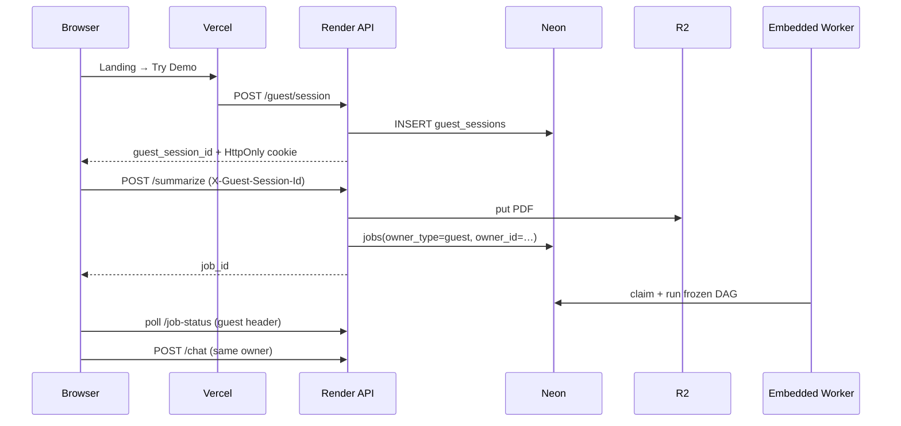

# Guest Mode Architecture

## Goal

Let visitors try the full platform without signing in — **same orchestration pipeline**, different **Owner**.



## Owner model

```
Owner
 ├── USER   (JWT → users.id)
 └── GUEST  (cookie/header → guest_sessions.session_id)
```

Every durable resource stamps:

| Column | Meaning |
|--------|---------|
| `owner_type` | `user` \| `guest` |
| `owner_id` | `str(user_id)` or guest UUID |
| `user_id` | FK for authenticated (null for guests) |

Tables: `jobs`, `documents`, `conversations`, plus `guest_sessions`.

## What does **not** change

Parser · adaptive chunking · planner · CRE · QVA · frozen DAG · scheduler · carbon · RAG · chat · indexing · execution graph.

Handlers take `Depends(get_current_owner)` instead of assuming a JWT user. The worker never branches on identity.

## Endpoints (no duplicates)

| Method | Path | Notes |
|--------|------|-------|
| POST | `/guest/session` | Create / resume |
| GET | `/guest/session` | Badge / 2h inactivity remaining |
| POST | `/guest/upgrade` | Guest → user transfer |
| * | `/summarize`, `/job-*`, `/chat`, … | Same as before; Owner-aware |

## Auth priority

1. Valid Bearer JWT → User owner  
2. Else guest cookie `ga_guest_session` or header `X-Guest-Session-Id`  
3. Else 401  

JWT flow for signed-in users is unchanged.

## Frontend

- Landing **Try Demo** → `ensureGuestSession()` → `/new-job`
- `apiFetch` sends Bearer **or** `X-Guest-Session-Id`
- `GuestSessionBadge` on dashboard (2h inactivity countdown + upgrade link; poll refreshes `last_activity`)
- Login calls `/guest/upgrade` when a guest id is present

## Deployment

Works on Render + Vercel + Neon + R2 + NIM. Cross-origin guests rely on the header fallback when `CORS_ORIGINS=*`.
