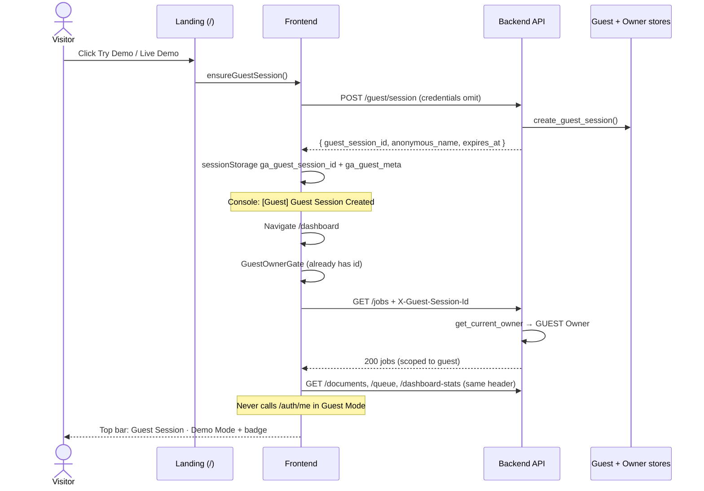

# Guest Mode Flow — End-to-End Audit & Architecture

**Status:** Implemented (header-based guest Owner, no cookie credentials required)  
**Date:** 2026-07-16  
**Scope:** Landing → Frontend → API → Backend ownership

---

## Verdict

Guest Mode failed as a product experience because the **frontend never completed the guest lifecycle** before calling Owner-scoped APIs, while also using **`credentials: "include"`** against CORS `Allow-Origin: *`. The backend Owner model (`USER` | `GUEST`) was already correct.

| Symptom | Root cause | Fix |
|--------|------------|-----|
| Live Demo → `/login` | `LiveDemoLink` hard-routed unauthenticated users to login | Create guest session → `/dashboard` |
| Try Demo → `/login` on failure | Hero `catch` fell back to `/login`; CORS blocked session create | No login fallback; `credentials: "omit"` |
| Top bar = “Not signed in” / Dashboard | Badge only if `sessionStorage` guest id existed; session never created | Gate + ensure session; Demo Mode UI |
| 401 `/auth/me` | Guests called JWT-only `/auth/me` | Skip `/auth/me` when no JWT; use guest meta |
| 401 jobs/docs/queue | No `X-Guest-Session-Id` on requests | Persist guest id; `apiFetch` always attaches header |
| CORS `*` + credentials | `apiFetch` / guest create / XHR used credentials | `credentials: "omit"` / `withCredentials = false` |

---

## Sequence diagram (happy path)



---

## Request flow (identity)

```
┌─────────────────────────────────────────────────────────────┐
│ Browser                                                      │
│  JWT? → Authorization: Bearer <token>                        │
│  else Guest? → X-Guest-Session-Id: <uuid> (sessionStorage)   │
│  credentials: omit  (never include)                          │
└───────────────────────────┬─────────────────────────────────┘
                            │
                            ▼
┌─────────────────────────────────────────────────────────────┐
│ get_current_owner (deps.py)                                  │
│  1. Valid JWT → Owner(USER, user_id)                         │
│  2. Else guest header/cookie → touch session → Owner(GUEST)  │
│  3. Else → 401                                               │
└─────────────────────────────────────────────────────────────┘
```

**Production architecture (local + Vercel→Render):**

- Guest identity = **header** `X-Guest-Session-Id` (primary).
- Cookie `ga_guest_session` is optional same-site bonus; **not required** cross-origin.
- JWT = **Bearer** header only.
- CORS may use `*` with `allow_credentials=false` — safe because we never send cookies on API calls.

---

## Frontend state machine

```
                    ┌─────────────┐
                    │  Anonymous  │  (no JWT, no guest id)
                    └──────┬──────┘
           Try Demo / Live Demo / GuestOwnerGate
                           │
                           ▼
                    ┌─────────────┐
           ┌───────│    Guest    │◄── resume POST /guest/session
           │       └──────┬──────┘
           │              │ login + POST /guest/upgrade
           │              ▼
           │       ┌─────────────┐
           │       │    User     │  (JWT; guest storage cleared)
           │       └─────────────┘
           │
           └── End demo → clear sessionStorage → Anonymous / Landing
```

| State | Storage | API auth | UI |
|-------|---------|----------|-----|
| Anonymous | — | none → 401 on Owner routes | Landing CTAs |
| Guest | `ga_guest_session_id`, `ga_guest_meta` | `X-Guest-Session-Id` | Demo Mode badge, Upgrade |
| User | `access_token`, `refresh_token` | `Authorization: Bearer` | Email, Settings, Log out |

---

## Backend ownership flow

1. `POST /guest/session` — create or resume (header/cookie); returns `guest_session_id`.
2. Business routes use `Depends(get_current_owner)` — jobs, documents, queue, dashboard-stats, summarize, chat, etc.
3. Rows stamped with `owner_type=guest`, `owner_id=<session uuid>`.
4. Sliding **2h inactivity** via `touch_guest_session` on Owner resolution.
5. `POST /guest/upgrade` (JWT required) — in-place transfer guest → user; no row copy.
6. `/auth/me` remains **JWT-only** — guests must not call it.

---

## Guest lifecycle

| Event | Endpoint / action | Client effect |
|-------|-------------------|---------------|
| Create | `POST /guest/session` | Persist id + meta; log Created |
| Resume | same + existing header | Persist; log Loaded |
| Activity | any Owner route | Backend slides `expires_at` |
| Expire | touch fails / cleanup | 401; log Expired |
| Upgrade | `POST /guest/upgrade` | Clear guest storage; log Upgrade |
| End demo | clear local | Back to `/` |

**Limits:** 1 document, 25 MB PDF, 50 chats (see guest store).

---

## Landing CTAs (Part 1)

| Control | Before | After |
|---------|--------|-------|
| **Try Demo** (Hero) | ensure guest → `/new-job`; on error → `/login` | ensure guest → `/dashboard`; on error → alert (stay) |
| **Live Demo** (Nav / Closing / Preview) | no JWT → `/login?next=/new-job` | ensure guest → `/dashboard` |
| **Sign In / Login** | `/login` | unchanged (authenticated path) |
| **Dashboard** (Nav) | bare link | `GuestOwnerGate` creates session if missing |

---

## Where it broke (Parts 2–3, 8)

**First failing request in the old flow:**

1. User opens `/new-job` (or dashboard) **without** ever calling `POST /guest/session`.
2. `apiFetch("/auth/me")` → **401** (no JWT) + often **CORS** if `credentials: include` + `*`.
3. `apiFetch("/jobs")` etc. → **401** (no guest header).

Session creation lived only behind CTAs that redirected to login on failure, so storage stayed empty → UI looked logged-out forever.

---

## Fixes applied (code)

| Area | Files |
|------|--------|
| Guest client | `frontend/lib/guest-session.ts` — omit credentials; diagnostics logs |
| API client | `frontend/lib/api.ts` — omit credentials; guest header; no login redirect for guests |
| Live Demo | `frontend/components/live-demo-link.tsx` |
| Try Demo | `frontend/components/site/Hero.jsx` |
| Owner gate | `frontend/components/guest-owner-gate.tsx` on dashboard / new-job / results |
| Persona hook | `frontend/hooks/use-current-user.ts` — skip `/auth/me` for guests |
| UI | `guest-session-badge.tsx`, `top-bar.tsx`, `sidebar.tsx`, `settings/page.tsx` |
| Upload XHR | `new-job/page.tsx` — `withCredentials = false` |
| Prefetch | `home-client.tsx` — prefer dashboard over login |

---

## Routing policy (Part 5)

| Route | Guest access |
|-------|----------------|
| `/` | Public |
| Try / Live Demo | Creates guest → app |
| `/login`, `/signup` | Auth only (upgrade entry) |
| `/dashboard`, `/new-job`, `/results` | Guest OK (gate ensures session) |
| Upload, queue, chat, execution graph, carbon | Guest OK via Owner |
| `/settings` | Visible; account actions require upgrade / sign-in |

Guests are **never** redirected to `/login` by `apiFetch` on 401.

---

## CORS policy (Part 7) — correct architecture

**Do not** force `credentials: include` for Guest Mode.

| Option | Decision |
|--------|----------|
| Guest via cookie only | Rejected for Vercel↔Render / localhost↔127.0.0.1 |
| Guest via `X-Guest-Session-Id` | **Chosen** |
| Echo specific origin + credentials | Optional for cookie UX; not required |
| `Access-Control-Allow-Origin: *` + omit credentials | **Supported** (local `CORS_ALLOW_ALL`, Bearer/header SPA) |

Backend already: `allow_headers=["*"]`, credentials disabled when origins include `*`.

---

## Developer diagnostics (Part 9)

Console (examples):

```
[Guest] Guest Session Created { guest_session_id, anonymous_name, expires_at }
[Guest] Guest Session Loaded …
[Guest] Guest Session Expired
[Guest] Guest Upgrade Attempt / Succeeded / Failed
[API] GET /jobs auth=guest   (dev)
[API] GET /auth/me auth=jwt  (dev; users only)
```

Top bar: `data-auth-mode="guest|user|anonymous"`.

---

## Acceptance checklist (Part 10)

- [x] Try Demo / Live Demo do **not** go to Login
- [x] Guest session created and stored
- [x] Redirect into app (`/dashboard`)
- [x] Demo Mode / Guest Session visible in top bar
- [x] Owner APIs accept guest header (jobs, docs, queue, stats)
- [x] No JWT required for demo path
- [x] No `credentials: include` on API/guest/upload
- [x] Guests not redirected to login on API 401
- [ ] Manual browser pass: upload → process → results → chat (run after API up)

---

## Manual verification

```bash
# 1. Create guest
curl -s -X POST http://127.0.0.1:8000/guest/session -H "Content-Type: application/json"

# 2. Use returned guest_session_id
curl -s http://127.0.0.1:8000/jobs -H "X-Guest-Session-Id: <id>"
curl -s http://127.0.0.1:8000/documents -H "X-Guest-Session-Id: <id>"
curl -s http://127.0.0.1:8000/queue -H "X-Guest-Session-Id: <id>"

# Expect 200 JSON, not 401. /auth/me without Bearer still 401 (by design).
```

Browser: open `/`, click **Try Demo** → Network shows `POST /guest/session` then dashboard calls with `X-Guest-Session-Id`; console shows Guest Session Created; badge shows Demo Mode.

---

## Related docs

- `GUEST_MODE_ARCHITECTURE.md` — Owner model
- `GUEST_MODE_LIFECYCLE.md` — expiry / cleanup
- `GUEST_MODE_SECURITY.md` — limits / abuse
- `SYSTEM_ARCHITECTURE.md` — system overview
