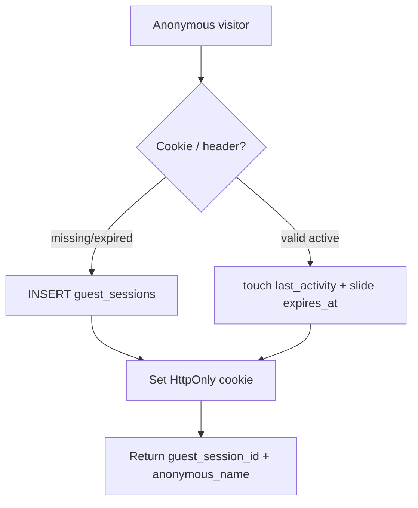
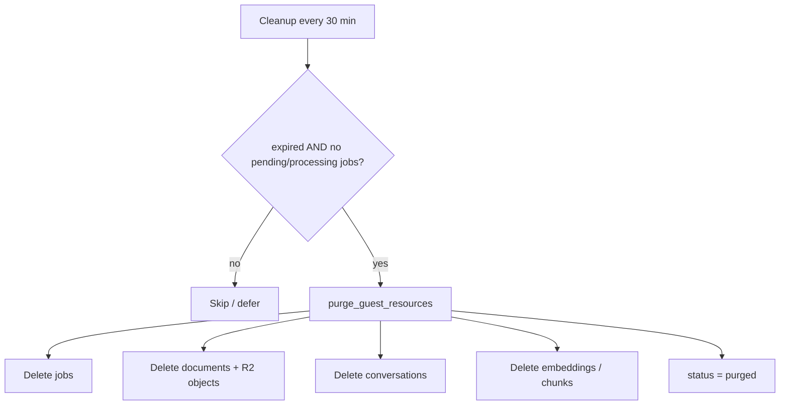
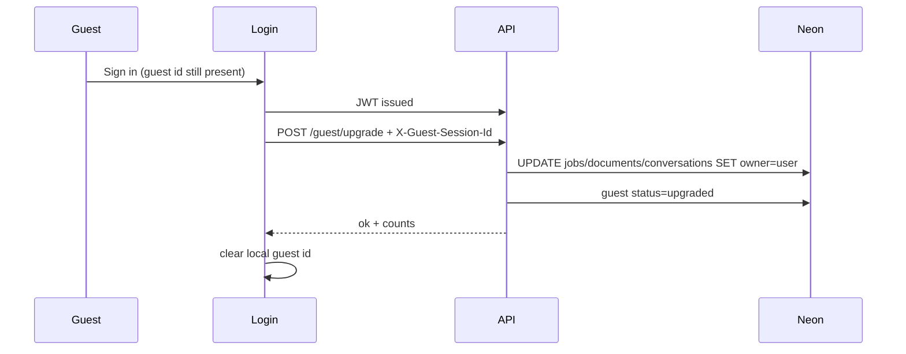

# Guest Mode Lifecycle

## Create



Defaults:

- **2 hours of inactivity** (not a hard wall-clock expiry). Every API request via `get_current_owner` refreshes `last_activity` and slides `expires_at`.
- `anonymous_name`: `Guest-XXXX`

## Active use

Every authenticated business request via `get_current_owner`:

1. Prefer JWT user  
2. Else touch guest session (sliding expiration)  
3. Stamp `owner_type` / `owner_id` on new jobs/docs  

Limits while active:

| Limit | Value |
|-------|-------|
| Active documents | 1 (retain-latest) |
| PDF size | 25 MB |
| Chats | 50 / session |
| Job runtime | same as authenticated |

## Expire

When `expires_at < now` or status marked expired — **and** no in-flight jobs:



### Exact SQL filter (`list_expired_sessions`)

```sql
guest_sessions.status NOT IN ('purged', 'upgraded')
AND (guest_sessions.status = 'expired' OR guest_sessions.expires_at < :now)
AND NOT EXISTS (
  SELECT 1 FROM jobs
  WHERE jobs.owner_type = 'guest'
    AND jobs.owner_id = guest_sessions.session_id
    AND jobs.status IN ('pending', 'processing')
)
```

**Active guests are never deleted.** Polling/`get_current_owner` slides `expires_at`, so a live demo mid-summary stays active. If the clock expires while a job is still queued/running (e.g. tab closed for >2h), cleanup **defers** until the job reaches a terminal status.

`cleanup_expired_guests` re-checks `guest_has_running_jobs` before purge (defense in depth).

## Upgrade (guest → user)



No pipeline recompute — ownership stamps move only.

## Operator notes

- Migration: `006_guest_owner`
- Cleanup starts in API lifespan (`ensure_guest_cleanup_loop`)
- Free-tier Chroma remains ephemeral; guest purge still removes DB + R2 pointers
