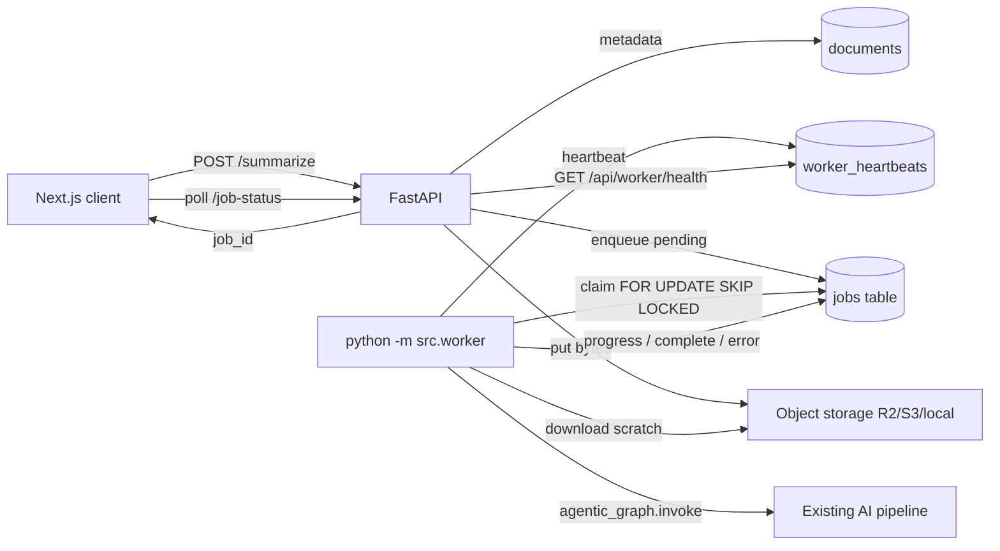

# Phase 3 — Durable Worker (Postgres/SQLite Job Queue)

**Status:** Implemented. Cloud deploy target is **Render** (see `RENDER_DEPLOYMENT.md`).

No Celery, Redis, Kafka, RabbitMQ, or Temporal. The `jobs` table is the queue.

---

## Architecture



### API responsibilities (only)
1. Validate + auth  
2. Upload file to object storage  
3. Create `documents` metadata + `jobs` row (`status=pending`)  
4. Return `job_id` immediately  

The API **never** runs the agentic graph.

### Worker responsibilities
1. Heartbeat → `worker_heartbeats`  
2. Reclaim stale `processing` jobs  
3. Atomically claim next `pending` job  
4. Download object → scratch path  
5. `agentic_graph.invoke(...)` (unchanged pipeline)  
6. Persist progress / result / error  
7. Optional understanding thread (same as before)

---

## Modified / new files

| Path | Change |
|------|--------|
| `backend/src/worker/` | New: `__main__.py`, `loop.py`, `runner.py` |
| `backend/src/db/jobs.py` | `enqueue_job`, `claim_next_job`, `reclaim_stale_jobs`, `fail_or_retry_job`, heartbeats |
| `backend/src/db/models.py` | Queue columns + `WorkerHeartbeatModel` |
| `backend/src/core/job_status.py` | `pending`, `cancelled`; empty → `pending` |
| `backend/src/core/config.py` | `WORKER_*` settings |
| `backend/src/api/main.py` | Enqueue-only `/summarize`; `GET /api/worker/health` |
| `backend/alembic/versions/004_job_queue_worker.py` | Migration |
| `backend/tests/test_phase3_worker.py` | Queue/claim/reclaim/worker tests |
| `backend/.env.example` | Worker env vars |

**Frozen (untouched):** CRE, Intelligent Router, Understanding/Response agents, Retrieval, Chunking, Validation.

---

## Database changes (Alembic `004_job_queue_worker`)

### `jobs` columns added
| Column | Purpose |
|--------|---------|
| `claimed_at` | When worker claimed the row |
| `claimed_by` | Worker instance id |
| `attempt_count` | Retry counter (incremented on claim) |
| `available_at` | Not claimable until this time (backoff) |
| `heartbeat_at` | Refreshed while processing; used for stale reclaim |

### `worker_heartbeats` table
`worker_id` PK, `hostname`, `status`, `last_seen_at`, `meta_json`, `created_at`

### Status lifecycle
```
pending → processing → complete | error | cancelled
```
Aliases: `completed`→`complete`, `failed`→`error`, `canceled`→`cancelled`.

---

## Worker lifecycle

```bash
# From backend/
python -m src.worker
python -m src.worker --worker-id api-box-1 --once   # one claim cycle (debug)
```

Loop:
1. Upsert heartbeat (`idle`)  
2. Every `WORKER_RECLAIM_INTERVAL_SEC`: `reclaim_stale_jobs()`  
3. `claim_next_job(worker_id)`  
4. If claimed → `process_claimed_job` → heartbeat `busy` → back to idle  
5. Else sleep `WORKER_POLL_INTERVAL_SEC`

### Claim locking
- **Postgres:** `SELECT … FOR UPDATE SKIP LOCKED` then update to `processing`  
- **SQLite (dev):** `BEGIN IMMEDIATE` + conditional `UPDATE … WHERE status='pending'`

Only one worker can win a given row.

---

## Retry strategy

| Setting | Default | Meaning |
|---------|---------|---------|
| `WORKER_MAX_ATTEMPTS` | 3 | Claims before terminal failure |
| `WORKER_RETRY_BACKOFF_SEC` | 30 | `available_at = now + backoff * attempt` |

On pipeline exception → `fail_or_retry_job`:
- If `attempt_count < max` → `pending` + delayed `available_at`  
- Else → `error` (terminal)

---

## Failure recovery

| Failure | Behavior |
|---------|----------|
| API crash after enqueue | Job stays `pending`; worker picks it up |
| Worker crash mid-job | `processing` + stale `heartbeat_at` → reclaim → `pending` (or `error` if max attempts) |
| Claim timeout | `WORKER_CLAIM_TIMEOUT_SEC` (default 900s) |
| Object missing | Job fails / retries via `fail_or_retry_job` |

Health: `GET /api/worker/health` — 200 if any heartbeat within `WORKER_HEARTBEAT_STALE_SEC`, else 503.

---

## Tests

```bash
cd backend
python -m pytest tests/test_phase3_worker.py tests/test_phase2_object_storage.py \
  tests/test_phase1_auth.py tests/test_phase0_health_config.py tests/test_job_status.py -q
```

Coverage includes: enqueue-only API, exclusive claim, stale reclaim, retry→terminal, fake-graph process, worker health.

---

## Ops notes

1. Run `alembic upgrade head` (through `004`).  
2. Run **API** and **worker** as separate processes.  
3. Production: Postgres URL + `OBJECT_STORAGE_BACKEND=r2`.  
4. Breaking: `/summarize` no longer processes in-process; without a worker, jobs stay `pending`.
