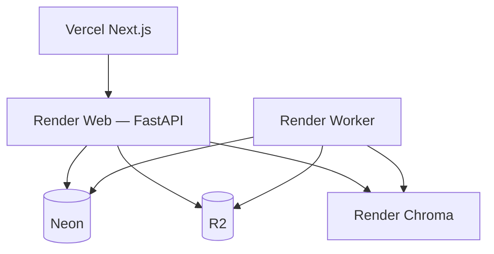

# Phase 4 — Docker + Render + Neon + R2

**Superseded for cloud deploy by:** [`RENDER_DEPLOYMENT.md`](./RENDER_DEPLOYMENT.md)

Railway configs have been **removed**. Production target is **Render**.

AI pipeline unchanged.

Local: `docker compose up --build`  
Cloud: see **RENDER_DEPLOYMENT.md**
