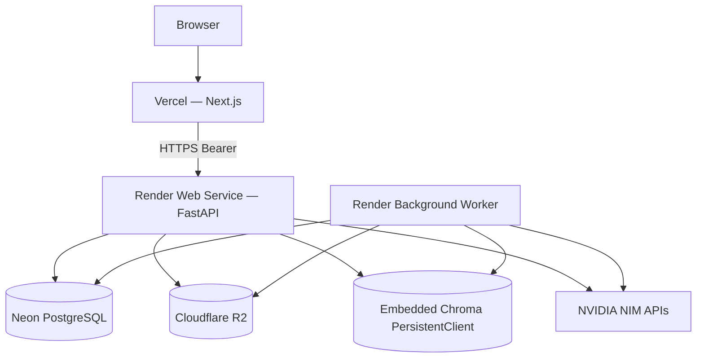

# Render Deployment Guide

**Platform:** Render (not Railway)  
**AI pipeline:** unchanged  



> The application currently uses an embedded Chroma instance for cost-efficient
> portfolio deployment. The production deployment architecture supports migrating
> to a standalone Chroma server (`HttpClient`) with no application-level changes
> beyond restoring the client factory branch.

---

## 1. Docker audit (current)

| Check | Status |
|-------|--------|
| Production-ready Dockerfile | Yes — multi-stage `builder` → `runtime` → `api` / `worker` |
| Multi-stage optimized | Yes — venv copy only; no compilers in runtime; CPU torch |
| API / Worker separated | Yes — distinct build targets + entrypoints |
| Image size | Large (torch/transformers/unstructured) but CUDA avoided; BuildKit pip cache |
| Build caching | `requirements.txt` copied before app code; pip cache mount |

**Local:** `docker compose up --build` (postgres + api + worker; embedded Chroma volume).

---

## 2. Render services

| Service | Type | Docker target | Start command | Health |
|---------|------|---------------|---------------|--------|
| `green-agentic-api` | **Web Service** | `api` | `/app/scripts/docker-entrypoint-api.sh` | `GET /api/health` |
| `green-agentic-worker` | **Background Worker** | `worker` | `/app/scripts/docker-entrypoint-worker.sh` | process + DB; app-level `/api/worker/health` |

No separate Chroma service — embeddings use `CHROMA_PERSIST_DIRECTORY` on the service disk.

**Root Directory:** `backend` (repo root → set Root Dir to `backend` in each Docker service).

**Build:** Dockerfile · Context `.` · **`dockerBuildTarget`** in `render.yaml`:
- API → `api`
- Worker → `worker`

Without `dockerBuildTarget`, Render may build the last Dockerfile stage (`worker`) for both services.

**Start:** `dockerCommand` in `render.yaml` (or Start Command in UI).

**Readiness (manual / smoke):** `GET /api/ready` — database + Chroma + object storage.

**Startup validation:**
- **API** — JWT + CORS required (`validate_for_runtime()`).
- **Worker** — JWT required; **CORS skipped** (`validate_for_runtime(require_cors=False)` / `SERVICE_ROLE=worker`). Worker has no HTTP CORS surface.

---

## 3. Setup checklist

1. [ ] Neon project → copy pooled `DATABASE_URL` (SSL)
2. [ ] Cloudflare R2 bucket + API token
3. [ ] NVIDIA NIM API key
4. [ ] Render → Blueprint (`backend/render.yaml`) **or** create API (+ optional Worker)
5. [ ] API Web Service: **`dockerBuildTarget: api`**, health `/api/health`, disk `/data`
6. [ ] Set `CHROMA_PERSIST_DIRECTORY=/data/chroma` (and `VECTOR_DB_PATH=/data/aux`)
7. [ ] Worker (optional): **`dockerBuildTarget: worker`**, same Neon + R2 + **same JWT_SECRET_KEY**
8. [ ] Set `CORS_ORIGINS` on **API** (or `*` for portfolio demos)
9. [ ] Deploy → `GET https://<api>.onrender.com/api/health` and `/api/ready`
10. [ ] Vercel: `NEXT_PUBLIC_API_URL=https://<api>.onrender.com`

---

## 4. Environment variable checklist

### CORS note (production)

- `CORS_ORIGINS=*` is allowed and disables credentialed cookies (Bearer-token SPAs are fine).
- Prefer your real Vercel origin when you have it: `https://your-app.vercel.app`.
- `CORS_ALLOW_ALL` is ignored in production — use `CORS_ORIGINS` only.

### Render API (Web Service)
| Variable | Required | Notes |
|----------|:--------:|-------|
| `APP_ENV` | ✓ | `production` |
| `PORT` | ✓ | Render sets this; entrypoint uses it |
| `DATABASE_URL` | ✓ | Neon |
| `JWT_SECRET_KEY` | ✓ | |
| `CORS_ORIGINS` | ✓ | Vercel origin(s), comma-separated |
| `CORS_ALLOW_ALL` | ✓ | `false` |
| `NVIDIA_API_KEY` | ✓ | |
| `OBJECT_STORAGE_BACKEND` | ✓ | `r2` |
| `R2_ACCOUNT_ID` / `R2_ACCESS_KEY_ID` / `R2_SECRET_ACCESS_KEY` / `R2_BUCKET` | ✓ | |
| `CHROMA_PERSIST_DIRECTORY` | ✓ | `/data/chroma` (embedded PersistentClient) |
| `CHROMA_COLLECTION_NAME` | ✓ | shared collection name |
| `RUN_MIGRATIONS_ON_STARTUP` | ✓ | `true` on API only |
| `PERSIST_JOBS_TO_DB` | ✓ | `true` |
| `VECTOR_DB_PATH` | | `/data/aux` (BM25/cache — not embeddings) |

### Render Worker
Must share Neon, R2, NVIDIA, and **JWT** with the API. Embedded Chroma on the
Worker disk is **separate** from the API disk unless you later use HttpClient.

| Variable | Required | Notes |
|----------|:--------:|-------|
| `APP_ENV` | ✓ | `production` |
| `SERVICE_ROLE` | ✓ | `worker` (skips CORS validation) |
| `DATABASE_URL` | ✓ | **Same** Neon URL as API |
| `JWT_SECRET_KEY` | ✓ | **Same value** as API |
| `NVIDIA_API_KEY` | ✓ | Same as API |
| `OBJECT_STORAGE_BACKEND` | ✓ | `r2` |
| `R2_*` | ✓ | Same as API |
| `CHROMA_PERSIST_DIRECTORY` | ✓ | `/data/chroma` |
| `RUN_MIGRATIONS_ON_STARTUP` | ✓ | `false` |
| `WORKER_ID` | ✓ | Unique per replica |
| `CORS_ORIGINS` | | Optional; not validated on worker |

---

## 5. Build & start commands

| Service | Build | Start | `SERVICE_ROLE` |
|---------|-------|-------|----------------|
| API | `docker build --target api` · Render `dockerBuildTarget: api` | `/app/scripts/docker-entrypoint-api.sh` | `api` |
| Worker | `docker build --target worker` · Render `dockerBuildTarget: worker` | `/app/scripts/docker-entrypoint-worker.sh` | `worker` |

Verify targets locally:
```bash
docker build --target api -t green-api .
docker build --target worker -t green-worker .
docker inspect green-api --format "{{index .Config.Env}}"   # includes SERVICE_ROLE=api
docker inspect green-worker --format "{{json .Config.Cmd}}" # docker-entrypoint-worker.sh
```

API entrypoint runs `alembic upgrade head` when `RUN_MIGRATIONS_ON_STARTUP=true`.

---

## 6. Health & readiness

| Probe | URL | Use |
|-------|-----|-----|
| Liveness | `GET /api/health` | Render Web Service health check |
| Readiness | `GET /api/ready` | DB + Chroma + R2/object storage |
| Worker | `GET /api/worker/health` | Heartbeats in Postgres |

---

## 7. Files (Render-focused)

| File | Role |
|------|------|
| `backend/Dockerfile` | Multi-stage api/worker |
| `backend/render.yaml` | Blueprint |
| `backend/docker-compose.yml` | Local parity |
| `backend/docs/RENDER_DEPLOYMENT.md` | This guide |
| `backend/.env.production.example` | Env template |
| `backend/scripts/migrate_render.sh` | Optional migrate helper |
| `backend/scripts/migrate_neon.sh` | Neon migrate helper |

**Removed:** `railway.toml`, `railway.worker.toml`, `scripts/migrate_railway.sh`

---

## 8. Smoke test

```bash
cd backend
set API_URL=https://<your-api>.onrender.com
set FRONTEND_URL=https://<your-app>.vercel.app
python scripts/smoke_production.py
```
