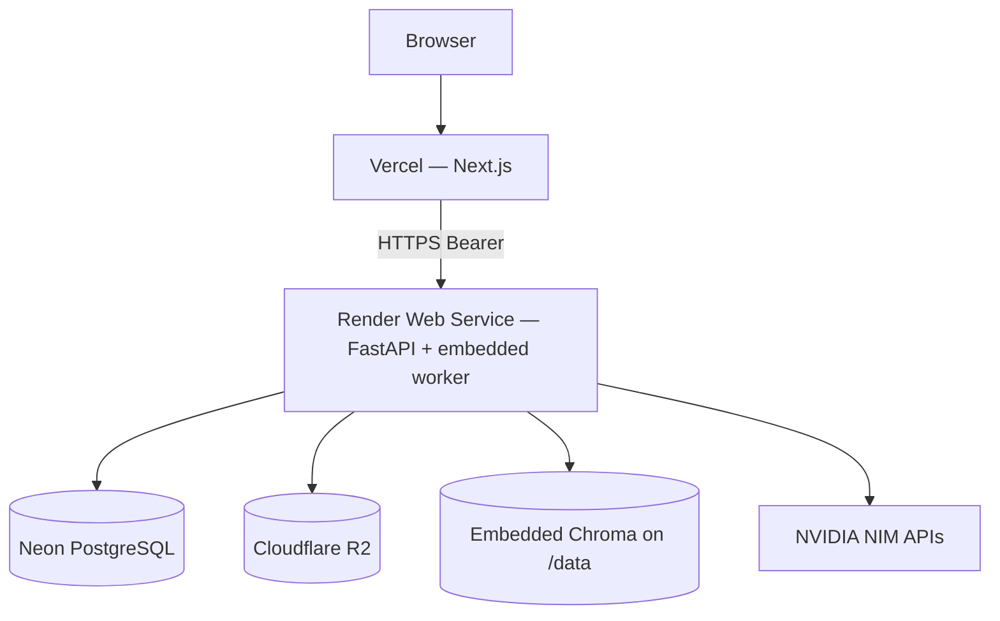

# Render Deployment Guide

**Platform:** Render (not Railway)  
**AI pipeline:** unchanged  



> **Default topology:** one Web Service with `RUN_EMBEDDED_WORKER=true`.  
> Worker and API must share the same Chroma persist directory. Render gives each
> service its **own** disk — a separate Background Worker therefore cannot see
> embeddings written for RAG on the API. Local `docker compose` is different:
> API and worker containers mount the **same** named volume.

---

## 1. Docker audit (current)

| Check | Status |
|-------|--------|
| Production-ready Dockerfile | Yes — multi-stage `builder` → `runtime` → `api` / `worker` |
| Multi-stage optimized | Yes — venv copy only; no compilers in runtime; CPU torch |
| API / Worker | Same image targets; portfolio runs worker **inside** API via `RUN_EMBEDDED_WORKER` |
| Build caching | `requirements.txt` copied before app code; pip cache mount |

**Local:** `cp .env.docker.example .env.docker` then `docker compose up --build`.

---

## 2. Render services

| Service | Type | Docker target | Start command | Health |
|---------|------|---------------|---------------|--------|
| `green-agentic-api` | **Web Service** | `api` | `/app/scripts/docker-entrypoint-api.sh` | `GET /api/health` |

Set on the service (UI or Blueprint):

| Setting | Value |
|---------|--------|
| Root Directory | `backend` |
| Dockerfile Path | `Dockerfile` |
| Docker Build Context Directory | `.` (relative to Root Directory) |
| **Docker Build Target** | **`api`** (required — last stage is `worker`) |
| Docker Command | `/app/scripts/docker-entrypoint-api.sh` |
| Health Check Path | `/api/health` |

**Blueprint files:**

- Repo root `render.yaml` (auto-detect) — `rootDir: backend`
- `backend/render.yaml` — same content for Root Directory = backend workflows

**Readiness (manual / smoke):** `GET /api/ready` — database + Chroma + object storage.  
**Worker heartbeat:** `GET /api/worker/health` — requires `RUN_EMBEDDED_WORKER=true` (or a live separate worker).

---

## 3. Setup checklist

1. [ ] Neon project → copy pooled `DATABASE_URL` (SSL)
2. [ ] Cloudflare R2 bucket + API token
3. [ ] NVIDIA NIM API key
4. [ ] Render → Blueprint (`render.yaml` at repo root) **or** create one Web Service
5. [ ] Confirm **`dockerBuildTarget: api`**
6. [ ] Set `RUN_EMBEDDED_WORKER=true` and `WORKER_ID=embedded-api-1`
7. [ ] Set `CHROMA_PERSIST_DIRECTORY=/data/chroma` and `VECTOR_DB_PATH=/data/aux`
8. [ ] Set `CORS_ORIGINS` to the Vercel origin (or `*` for portfolio demos)
9. [ ] Deploy → `GET https://<api>.onrender.com/api/health`, `/api/ready`, `/api/worker/health`
10. [ ] Vercel: Root Directory `frontend`, `NEXT_PUBLIC_API_URL=https://<api>.onrender.com`

---

## 4. Environment variable checklist

### CORS note (production)

- `CORS_ORIGINS=*` is allowed and disables credentialed cookies (Bearer-token SPAs are fine).
- Prefer your real Vercel origin when you have it: `https://your-app.vercel.app`.
- `CORS_ALLOW_ALL` is ignored in production — use `CORS_ORIGINS` only.

### Render API (Web Service + embedded worker)

| Variable | Required | Notes |
|----------|:--------:|-------|
| `APP_ENV` | ✓ | `production` |
| `SERVICE_ROLE` | ✓ | `api` |
| `PORT` | ✓ | Render sets this; entrypoint uses it |
| `DATABASE_URL` | ✓ | Neon |
| `JWT_SECRET_KEY` | ✓ | |
| `CORS_ORIGINS` | ✓ | Vercel origin(s), comma-separated |
| `CORS_ALLOW_ALL` | ✓ | `false` |
| `NVIDIA_API_KEY` | ✓ | |
| `OBJECT_STORAGE_BACKEND` | ✓ | `r2` |
| `R2_ACCOUNT_ID` / `R2_ACCESS_KEY_ID` / `R2_SECRET_ACCESS_KEY` / `R2_BUCKET` | ✓ | |
| `CHROMA_PERSIST_DIRECTORY` | ✓ | `/data/chroma` |
| `CHROMA_COLLECTION_NAME` | ✓ | shared collection name |
| `RUN_MIGRATIONS_ON_STARTUP` | ✓ | `true` |
| `RUN_EMBEDDED_WORKER` | ✓ | `true` for portfolio |
| `WORKER_ID` | ✓ | e.g. `embedded-api-1` |
| `PERSIST_JOBS_TO_DB` | ✓ | `true` |
| `VECTOR_DB_PATH` | | `/data/aux` (BM25/cache — not embeddings) |

### Free tier notes

- No persistent disk: vectors are lost on restart/redeploy (re-ingest after wake).
- Service sleeps after ~15 minutes idle; first request cold-starts.
- Background Worker plans are paid — embedded worker avoids that cost.

---

## 5. Build & start commands

| Service | Build | Start | `SERVICE_ROLE` |
|---------|-------|-------|----------------|
| API (+ embedded worker) | `docker build --target api` · Render `dockerBuildTarget: api` | `/app/scripts/docker-entrypoint-api.sh` | `api` |

Verify targets locally:
```bash
docker build --target api -t green-api .
docker inspect green-api --format "{{index .Config.Env}}"   # includes SERVICE_ROLE=api
```

API entrypoint runs `alembic upgrade head` when `RUN_MIGRATIONS_ON_STARTUP=true`, then binds uvicorn, then starts the embedded worker after `/api/health` succeeds.

---

## 6. Health & readiness

| Probe | URL | Use |
|-------|-----|-----|
| Liveness | `GET /api/health` | Render Web Service health check |
| Readiness | `GET /api/ready` | DB + Chroma + R2/object storage |
| Worker | `GET /api/worker/health` | Heartbeats in Postgres |

---

## 7. Files (Render-focused)

| File | Role |
|------|------|
| `render.yaml` (repo root) | Blueprint (auto-detect) |
| `backend/render.yaml` | Blueprint when Root Dir = backend |
| `backend/Dockerfile` | Multi-stage api/worker |
| `backend/docker-compose.yml` | Local parity (shared volume) |
| `backend/docs/RENDER_DEPLOYMENT.md` | This guide |
| `backend/.env.production.example` | Env template |
| `backend/.env.docker.example` | Compose secrets template |
| `backend/scripts/docker-entrypoint-api.sh` | API + optional embedded worker |
| `backend/scripts/smoke_production.py` | E2E smoke |

---

## 8. Smoke test

```bash
cd backend
set API_URL=https://<your-api>.onrender.com
set FRONTEND_URL=https://<your-app>.vercel.app
python scripts/smoke_production.py
```
